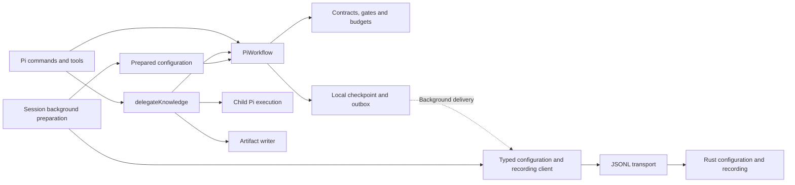

# Pi adapter architecture

The Pi extension owns the executable knowledge workflow. It decides phases,
assignments, gates, feedback, approvals, and budgets; executes agents; and
validates their artifacts. Rust resolves configuration and stores the facts Pi
reports. [RFC 0006](../../../docs/rfcs/0006-configuration-recording-and-adapter-workflows.md)
explains this ownership boundary.

Rust is never an execution prerequisite. The local workflow becomes available
before bridge startup, and every workflow operation completes independently of
configuration and recording RPCs. A missing, slow, or rejecting recorder
changes telemetry status, not whether Pi can work.



## Code navigation map

| Responsibility | Module |
| --- | --- |
| Compose dependencies and register the extension | `src/extension.ts` |
| Commands, tools, session hooks, and presentation | `src/pi/` |
| Background configuration preparation and last available snapshot | `src/pi/configuration.ts` |
| Coordinate delegation with injected execution and writing dependencies | `src/actions/delegate-knowledge.ts` |
| Own start, assignment, completion, advancement, and recovery decisions | `src/workflow/controller.ts` |
| Phase roles and execution budgets | `src/workflow/policy.ts` |
| Artifact contracts, cross-artifact gates, and plan validation | `src/workflow/contracts.ts` |
| Bounded evidence reads, path confinement, and digests | `src/workflow/evidence.ts` |
| Local checkpoint and pending recording events | `src/workflow/journal.ts` |
| Typed configuration, recording, and inspection operations | `src/bridge/xper-client.ts` |
| Transport, correlation, handshake, envelopes, and errors | `src/bridge/client.ts`, `protocol.ts` |
| Role prompts, child Pi execution, and output writing | `src/knowledge/` |

Actions receive their effects explicitly and remain testable without Pi,
processes, or files. Workflow rules live in the adapter's workflow modules,
not in the bridge client or Rust. The client validates the public boundary;
it does not hide workflow commands behind recording calls.

## Workflow activation and delegation

`/xper <objective>` and `/xper start <objective>` start or resume the session's
Pi workflow. Bare `/xper` requests the objective through Pi's interactive UI.
Starting displays the phase and next action without changing the system prompt
or automatically running a model.

`xper_delegate` asks the local workflow for its current assignment, executes
the selected role in a child Pi process, saves its output, and reports the
result locally. Pi validates the artifact and evaluates the gate after success.
`/xper advance` reevaluates the gate; `/xper approve <artifactId>` supplies an
explicit user decision for a pending human gate. The delegation tool never
grants human approval.

Discovery retains its Markdown Brief. Define through Plan use versioned JSON
artifacts. Feedback can revisit the responsible phase; accepted evidence is
invalidated from that phase onward. Plan validates an execution DAG and stops
ready for implementation. The [knowledge workflow guide](../../../docs/knowledge-workflow.md)
defines these contracts and limits.

Success, failure, cancellation, timeout, and interruption remain distinct.
Output paths are published only after writing, and existing evidence is never
overwritten. A late success may become `timed_out` under Pi's execution policy.
Recording transport failure does not change that policy's result.

## Configuration and recording boundary

`XperClient` provides configuration resolution, profile inspection, event
append, and run-status queries. `BridgeClient` owns framing and handshake.
The recording connection requires the `eventRecording` and
`configurationResolution` capabilities; local workflow operation does not
depend on obtaining that connection. The previous core workflow mutation
methods are removed.

Session preparation obtains the model catalog and resolves configuration in
the background. The last available snapshot is cached locally in
`.xper/pi/configuration.json`; status distinguishes defaults, cached, and
resolved configuration and exposes preparation errors. Rust enforces configured provider allowlists and
model/thinking compatibility during resolution. A new run takes the latest
available prepared configuration or Pi defaults immediately, exposes degraded
preparation, and freezes the route and workflow policy in its checkpoint.
A response arriving later does not alter the active run. When a prepared route
is present, Pi selects the current role from it. The existing
`workflow.knowledge` settings pass through Rust; Pi validates budgets and human
gates. An unavailable prepared profile must not be presented as applied when
the run actually started with defaults.

Reconnecting replaces the recording connection without replacing the local
controller or marking a running attempt interrupted. Session changes and
shutdown stop local delivery; bridge shutdown proceeds in the background.

Pi uses its normal credentials and model configuration. Context allowlists do
not distinguish accounts exposed under the same provider identifier.
Initialization and installation diagnostics remain in the Rust CLI; the
extension does not duplicate `xper init` or `xper doctor`.

Events report decisions already made by Pi. Rust checks envelope integrity,
session ownership, and duplicate consistency. It accepts arbitrary phase names
and does not validate Pi's transitions, artifacts, approvals, or budgets.
Generic status and usage summaries are projections of these observations.
Workflow-specific metrics need explicit facts from the adapter.

Completed assistant messages also produce `model.usage` observations with the
actual response provider/model when available. Input and output counts remain
separate from `cacheReadTokens` and `cacheWriteTokens`; cached-token counts are
event metadata, not part of the current aggregate. Pi's computed cost is
labelled `costSource: "pi_estimate"`, so it cannot be confused with a verified
provider bill or a workflow budget reservation. Missing usage remains unknown.

## Checkpoints, pending events, and recovery

The journal stores a checkpoint and outbox atomically at
`.xper/pi/<sha256(sessionId)>.json`. Event IDs remain stable across retries.
Workflow operations update local state and schedule delivery; they never await
the delivery worker, a recorder query, or bridge startup. Pending events are
released only after a persistent core acknowledgement.
Volatile acknowledgements and transport errors retain pending records and
surface degraded recording. Permanent rejections are retained separately and
surfaced; they cannot hold up subsequent events or workflow operations.
A local write failure retains state in memory and
allows the workflow to continue, but survival after process exit is then
unverified.

A checkpoint is metadata-only adapter state. It excludes prompts and artifact
contents; those artifacts remain files. Small checkpoints use `adapter.state`.
Larger checkpoints use `adapter.state.chunk` events containing a checkpoint ID,
chunk index, total count, and content. Rust stores these as opaque events.
Only Pi assembles and validates the checkpoint schema.

The client paginates inspection reads and batches recording writes to respect
the bridge frame limit. Workflow recovery loads the local checkpoint, without
consulting Rust first. Recorded checkpoints remain available for inspection;
the controller does not automatically fetch them as a prerequisite for starting
or resuming. A missing local checkpoint does not trigger remote recovery on the
execution path. Pending events can be resent safely without duplicating the
event log or executing an agent again.

`/xper status` reads local workflow state and shows delivery/preparation health.
`xper status` queries the shared Rust record, which can lag while events are
pending or rejected. Neither the first local status request nor a delegation
waits for an unresolved recording RPC. An unreadable or invalid local checkpoint
is still an integrity error; the adapter preserves it rather than guessing how
to resume.

Pi marks unfinished attempts interrupted when recovering its own workflow;
this means their execution outcome is unknown. The core never manufactures
that outcome merely by reopening SQLite. An explicit retry of an interrupted
assignment reuses its frozen model selection and input identities.

Legacy core-owned runs lack a Pi checkpoint. They remain inspectable through
`xper status`, but do not resume as a local Pi workflow. A new local run does
not require a successful legacy-history query. This migration does not delete
or reinterpret the original logs.

## Extending the adapter

1. Add workflow rules to the module that owns their policy.
2. Keep file/process/Pi effects separate from actions that coordinate them.
3. Report explicit facts with stable IDs; do not infer outcomes from generic
   tool observations.
4. Add core operations only for configuration, recording, or inspection needs.
5. Update checkpoint compatibility and recovery tests when its schema changes.

A future decision about more autonomous agents belongs here. It does not
require adding a phase state machine to Rust.

## Verification

From the repository root:

```bash
npm run boundaries --workspace @xper/adapter-pi
npm run typecheck --workspace @xper/adapter-pi
npm run test --workspace @xper/adapter-pi
```

[check-boundaries.mjs](../scripts/check-boundaries.mjs) checks access to the
core through the typed public protocol and keeps workflow rules inside the
adapter. It blocks direct recorder/configuration calls from workflow modules
outside the journal and forbids awaiting telemetry delivery in actions and
command/tool entry points. It also protects injected action dependencies and
keeps workflow modules independent of the bridge process. These are static
conventions, not a complete TypeScript analysis; unresolved-promise tests check
the execution guarantee dynamically.

Workflow and action tests use controlled dependencies and synthetic artifacts.
Recording integration uses the real Rust bridge and SQLite with simulated
execution, requiring the checkout and toolchain but no model credentials.
Tests must cover interrupted execution, local checkpoint integrity, delayed
configuration, and missing/rejecting/never-resolving recording without delaying
workflow operations or changing their outcomes. Run `npm run check`
before delivering code changes.
