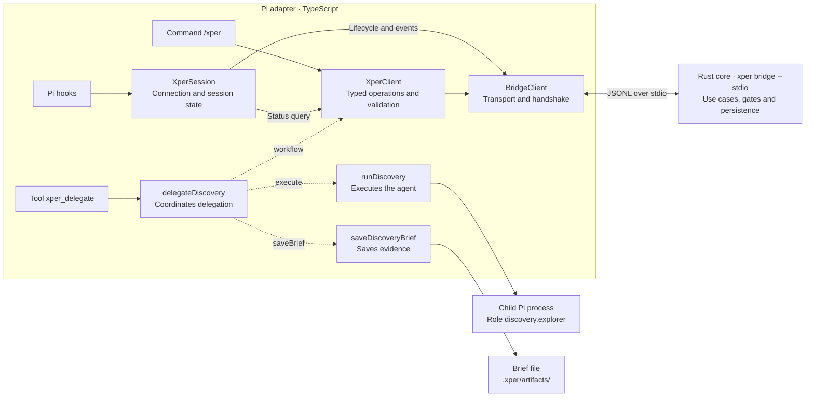

# Pi adapter architecture

This guide describes the Pi TypeScript extension: how it connects harness
commands, tools, and events to xper. The Rust domain, persistence, and use cases
are documented in the [core architecture](../../../docs/architecture.md).
[RFC 0004](../../../docs/rfcs/0004-pi-integration.md) records integration
decisions, and the [public protocol](../../../schemas/README.md) defines the
cross-process boundary.

## Responsibilities and composition

The extension has small integration actions. Gate and transition rules remain
in the Rust core's use cases. The adapter translates the Pi API, executes
agents, saves their artifacts, and presents results.

[extension.ts](../src/extension.ts) composes the session, executor, and artifact
writer, and registers commands, tools, and hooks. Bridge process creation is
deferred until the session starts.

The diagram shows the main execution paths. Dashed arrows are dependencies
injected into the action; solid arrows represent calls or effects.
`extension.ts` connects these pieces when registering the extension.



The action requests an assignment from the core, records the result, and asks
to advance after success. The core decides the transition and evaluates gates.
The child Pi process executes the assigned role; its result returns to the
action so it can save the Brief and report it to the core.

| Responsibility | Module |
| --- | --- |
| Register `/xper` and present its results | [pi/xper-command.ts](../src/pi/xper-command.ts) |
| Register `xper_delegate` and translate its input and output | [pi/xper-delegate.ts](../src/pi/xper-delegate.ts) |
| Session and tool hooks | [pi/hooks.ts](../src/pi/hooks.ts) |
| Connection, lifecycle, and latest typed state | [pi/session.ts](../src/pi/session.ts) |
| Pi observations and local log | [pi/observations.ts](../src/pi/observations.ts) |
| Coordinate a local delegation | [actions/delegate-discovery.ts](../src/actions/delegate-discovery.ts) |
| Typed xper operations and response validation | [bridge/xper-client.ts](../src/bridge/xper-client.ts) |
| JSONL transport, correlation, and handshake | [bridge/client.ts](../src/bridge/client.ts) |
| Public protocol envelopes and errors | [bridge/protocol.ts](../src/bridge/protocol.ts) |
| Resolve roles, execute Pi, and normalize results | [discovery/delegate.ts](../src/discovery/delegate.ts) |
| Write the Brief without overwriting existing evidence | [discovery/artifacts.ts](../src/discovery/artifacts.ts) |

## Delegation flow

`delegateDiscovery` receives execution and writing functions, a workflow
client, and an optional observation callback. It can be tested without
processes, files, or the Pi API. It creates the assignment through the core,
executes the agent, saves evidence, and reports the result. After success it
requests advancement and returns the phase reported by the core, including a
blocked gate.

Local execution or write errors produce a failed result; cancellation remains
cancellation. An empty Brief does not produce success, and the artifact path is
returned only after saving it. If the bridge fails while recording the result
or advancing, the error propagates without inventing another result or retrying
a mutation that may already have committed.

## Boundary with the core

`XperClient` provides `startRun`, `startAssignment`, `finishAttempt`,
`advanceRun`, and `getRunStatus`. It validates responses and assignment/attempt
correlations before returning them to the consumer, preserving original RPC
errors. Additional fields are allowed for compatible evolution. Only projection
fields used by the extension are typed and validated in status responses; the
timeline remains opaque, and domain rules are not reconstructed in TypeScript.

`BridgeClient` retains JSONL transport and the handshake. `XperSession` retains
the connection, lifecycle, and latest typed state. Actions do not import process,
file, or Pi registration implementations. They do not need a service container
or a second domain/application hierarchy.

Installation setup through `xper init` and `xper doctor` belongs to the CLI.
Its [local Pi implementation](../../../crates/xper-cli/src/infrastructure/installation.rs)
implements the core's `Installation` port; the extension does not duplicate
that flow.

## Extending the adapter

1. Add a local action when execution or effects need coordination.
2. Make its dependencies explicit and test it with doubles without starting Pi.
3. Add the required public core operations to the typed client, validating
   responses before consuming them.
4. Connect the action to commands, tools, or hooks and check the integration.

New workflow rules belong in the core. Changes to lifecycle, the Pi API, or
its presentation belong in this adapter.

## Adapter verification

From the repository root:

```bash
npm run boundaries --workspace @xper/adapter-pi
npm run typecheck --workspace @xper/adapter-pi
npm run test --workspace @xper/adapter-pi
```

[check-boundaries.mjs](../scripts/check-boundaries.mjs) reads only this package
and does not require Cargo. It checks access to the core through the public
protocol, that actions receive their I/O dependencies, and that workflow
operations go through the typed client. It is a static convention check, not
a complete TypeScript analysis.

Action and typed-client tests use simulated dependencies. Artifact-writer
tests use temporary directories. Integration tests start the Rust bridge and
a simulated Pi process to check the vertical slice, recovery, and session
isolation; they require the core checkout and toolchain but no model credentials.
