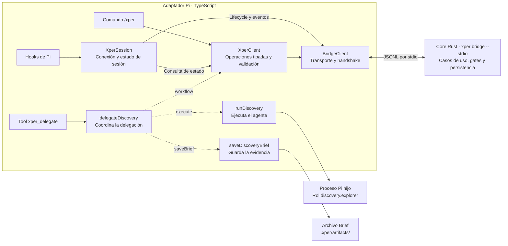

# Arquitectura del adaptador Pi

Esta guía describe la extensión TypeScript de Pi: cómo conecta comandos, tools
y eventos del harness con xper. El dominio, la persistencia y los casos de uso
Rust se documentan en la [arquitectura del core](../../../docs/architecture.md).
El [RFC 0004](../../../docs/rfcs/0004-integracion-con-pi.md) recoge las decisiones
de integración y el [protocolo público](../../../schemas/README.md) define la
frontera entre procesos.

## Responsabilidades y composición

La extensión tiene acciones de integración pequeñas. Las reglas de gates y
transiciones siguen en los casos de uso del core Rust. El adaptador traduce la
API de Pi, ejecuta agentes, guarda sus artefactos y presenta los resultados.

[extension.ts](../src/extension.ts) compone la sesión, el ejecutor y la escritura
de artefactos, y registra comandos, tools y hooks. La creación del proceso bridge
se difiere hasta el inicio de la sesión.

El diagrama muestra las rutas principales de ejecución. Las flechas discontinuas
son dependencias que se inyectan en la acción; las continuas representan llamadas
o efectos. `extension.ts` conecta estas piezas al registrar la extensión.



La acción solicita al core el assignment, registra el resultado y, tras un éxito,
pide avanzar. El core decide la transición y evalúa los gates. El proceso Pi hijo
ejecuta el rol asignado; su resultado vuelve a la acción para guardar el Brief y
comunicarlo al core.

| Responsabilidad | Módulo |
| --- | --- |
| Registro de `/xper` y presentación de sus resultados | [pi/xper-command.ts](../src/pi/xper-command.ts) |
| Registro de `xper_delegate` y traducción de su entrada y salida | [pi/xper-delegate.ts](../src/pi/xper-delegate.ts) |
| Hooks de sesión y herramientas | [pi/hooks.ts](../src/pi/hooks.ts) |
| Conexión, lifecycle y último estado tipado | [pi/session.ts](../src/pi/session.ts) |
| Observaciones de Pi y log local | [pi/observations.ts](../src/pi/observations.ts) |
| Coordinación de una delegación local | [actions/delegate-discovery.ts](../src/actions/delegate-discovery.ts) |
| Operaciones tipadas de xper y validación de respuestas | [bridge/xper-client.ts](../src/bridge/xper-client.ts) |
| Transporte JSONL, correlación y handshake | [bridge/client.ts](../src/bridge/client.ts) |
| Envelopes y errores del protocolo público | [bridge/protocol.ts](../src/bridge/protocol.ts) |
| Resolución del rol, ejecución de Pi y normalización del resultado | [discovery/delegate.ts](../src/discovery/delegate.ts) |
| Escritura del Brief sin sobrescribir evidencia existente | [discovery/artifacts.ts](../src/discovery/artifacts.ts) |

## Flujo de delegación

`delegateDiscovery` recibe funciones de ejecución y escritura, un cliente de
workflow y un callback opcional de observaciones. Se puede probar sin procesos,
archivos ni API de Pi. Crea el assignment mediante el core, ejecuta el agente,
guarda la evidencia y comunica el resultado. Tras un éxito solicita el avance y
devuelve la fase indicada por el core, incluido un gate bloqueado.

Los fallos locales de ejecución o escritura producen un resultado fallido; una
cancelación se conserva como tal. Un Brief vacío no produce un éxito y la ruta
del artefacto sólo se devuelve después de guardarlo. Si falla el bridge al
registrar el resultado o avanzar, el error se propaga sin inventar otro
resultado ni reintentar una mutación cuyo commit podría haberse realizado.

## Frontera con el core

`XperClient` ofrece `startRun`, `startAssignment`, `finishAttempt`, `advanceRun`
y `getRunStatus`. Valida las respuestas y las correlaciones de assignment y
attempt antes de entregarlas al consumidor; conserva los errores RPC originales.
Los campos adicionales se admiten para permitir evolución compatible. En el
estado sólo se tipan y validan los campos de proyección que utiliza la extensión;
la timeline permanece opaca y no se reconstruyen reglas del dominio en TypeScript.

`BridgeClient` conserva el transporte JSONL y el handshake. `XperSession` conserva
la conexión, el lifecycle y el último estado tipado. Las acciones no importan
implementaciones de procesos, archivos ni registros de Pi. No necesitan un
contenedor de servicios ni una segunda jerarquía de dominio/aplicación.

La preparación de la instalación mediante `xper init` y `xper doctor` pertenece
al CLI. Su [implementación local para Pi](../../../crates/xper-cli/src/infrastructure/installation.rs)
implementa el puerto `Installation` del core; la extensión no duplica ese flujo.

## Cómo ampliar el adaptador

1. Añadir una acción local cuando sea necesario coordinar ejecución o efectos.
2. Explicitar sus dependencias y probarla con dobles sin arrancar Pi.
3. Añadir al cliente tipado las operaciones públicas del core que necesite,
   validando las respuestas antes de consumirlas.
4. Conectar la acción a comandos, tools o hooks y comprobar la integración.

Las reglas nuevas del workflow se incorporan al core. Los cambios en el
lifecycle, la API de Pi o su presentación pertenecen a este adaptador.

## Verificación del adaptador

Desde la raíz del repositorio:

```bash
npm run boundaries --workspace @xper/adapter-pi
npm run typecheck --workspace @xper/adapter-pi
npm run test --workspace @xper/adapter-pi
```

[check-boundaries.mjs](../scripts/check-boundaries.mjs) sólo lee este paquete y
no requiere Cargo. Comprueba el acceso al core mediante el protocolo público,
que las acciones reciban sus dependencias de I/O y que las operaciones de
workflow se invoquen mediante el cliente tipado. Es una comprobación estática
de convenciones, no un análisis completo de TypeScript.

Las pruebas de la acción y del cliente tipado usan dependencias simuladas.
Las del escritor de artefactos usan directorios temporales. Las pruebas de
integración arrancan el bridge Rust y un proceso Pi simulado para comprobar la
vertical, la recuperación y el aislamiento de sesiones; requieren el checkout
del core y su toolchain, pero no credenciales de modelos.
