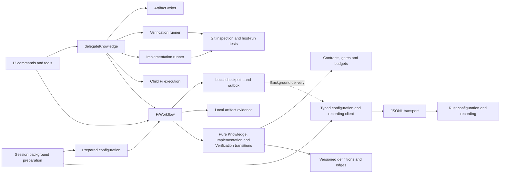

# Pi adapter architecture

The Pi extension owns the executable Knowledge and per-increment workflows. It
decides assignments, gates, feedback, approvals, and budgets; executes agents;
and validates artifacts and checkout evidence. Rust resolves configuration and
stores the facts Pi reports. [RFC 0006](../../../docs/rfcs/0006-configuration-recording-and-adapter-workflows.md)
explains this ownership boundary.
[RFC 0007](../../../docs/rfcs/0007-explicit-adapter-state-machines.md) explains
the explicit state machine and future composition and visualization boundaries.

Rust is never an execution prerequisite. The local workflow becomes available
before bridge startup, and every workflow operation completes independently of
configuration and recording RPCs. A missing, slow, or rejecting recorder
changes telemetry status, not whether Pi can work.



## Code navigation map

| Responsibility | Module |
| --- | --- |
| Compose dependencies and register the extension | `src/extension.ts` |
| Commands, tools, session hooks, and presentation | `src/pi/` |
| Background configuration preparation and last available snapshot | `src/pi/configuration.ts` |
| Coordinate delegation with injected execution and writing dependencies | `src/actions/delegate-knowledge.ts` |
| Prepare evidence, time and IDs; invoke transitions; commit local state | `src/workflow/controller.ts` |
| Pure Knowledge start, assignment, completion, advancement, and recovery decisions | `src/workflow/knowledge-machine.ts` |
| Pure per-increment Implementation transition and result validation | `src/workflow/implementation.ts` |
| Pure per-increment Verification transition and result validation | `src/workflow/verification.ts` |
| Versioned serializable topology and explicit transition edges | `src/workflow/definition.ts` |
| Runtime state, checkpoint validation, and migration | `src/workflow/state.ts` |
| Phase roles and execution budgets | `src/workflow/policy.ts` |
| Artifact contracts, cross-artifact gates, and plan validation | `src/workflow/contracts.ts` |
| Bounded evidence reads, path confinement, and digests | `src/workflow/evidence.ts` |
| Local checkpoint and pending recording events | `src/workflow/journal.ts` |
| Typed configuration, recording, and inspection operations | `src/bridge/xper-client.ts` |
| Transport, correlation, handshake, envelopes, and errors | `src/bridge/client.ts`, `protocol.ts` |
| Role prompts, child Pi execution, and output writing | `src/knowledge/` |
| Implementer handoff, Git inspection, host-run tests, and result construction | `src/implementation/` |
| Verifier proposal validation, host-run tests, and canonical review construction | `src/verification/` |

Actions receive their effects explicitly and remain testable without Pi,
processes, or files. Workflow rules live in the adapter's workflow modules,
not in the bridge client or Rust. The client validates the public boundary;
it does not hide workflow commands behind recording calls.

## Explicit state machine

`PiWorkflow` is the runtime boundary. It loads the local checkpoint, reads and
verifies artifact evidence, supplies IDs and time, and invokes the applicable
pure transition function. Each reducer owns its state changes and decisions and
returns the next state, result, and facts. Local persistence and agent execution
stay outside them; neither reducer nor its guards consult Rust.

The `pi.knowledge` definition at version 2 declares the five knowledge nodes
and a terminal ready node, with stable IDs and explicit edges. Its only outgoing
terminal edges are delivery feedback from `ready` to Define or Design. Execution
reads those edges; phase-array order is not a second transition rule. Domain
guards still validate budgets, approvals, and evidence before taking an edge.
The JSON definition describes possible paths, not an executable replacement for
those rules.

State carries a definition reference and workflow instance ID. New runs generate
a separate instance ID; migrated format-1 checkpoints retain the run ID as their
instance ID for historical stability. Its lifecycle is
`active`, `awaiting_approval` with the exact visit and artifact, or `completed`
with the sealed Plan artifact. Phase visits and per-attempt outcomes remain
separate. Compatibility fields such as `human_input` and `ready` are derived for
presentation, not independent mutable state. Knowledge state version 3 adds
imported references to artifacts owned by another flow; these references make a
Verification result a stable revisit input without copying it into Knowledge's
artifact registry.

Knowledge completion hands off the sealed Plan to a separate
`pi.implementation` definition at version 1. Each instance is keyed by increment
and transitions from `implement` to terminal `implemented` only after host-owned
Git and test checks pass. This composition does not expand the Knowledge phase
enum or imply product acceptance. Its exact result then hands off to a
`pi.verification` v1 instance, which transitions from `verify` to terminal
`verified` or `rejected`. An ordinary rejection makes a fresh Implementation
instance eligible while retaining both histories and consumed budgets. Structured
criteria/design feedback instead reopens the same Knowledge instance and starts
a reconciliation between its historical and revised Plans. Verification does not
close the run. After a verified result, another explicit delegation selects the
next Plan-eligible increment; verifying them all makes Judgment Day eligible.
[XP-015](../../../docs/tasks/015-workflow-visualization.md) tracks a read-only UI
combining the versioned graph with reported positions and history, including
incomplete recording. Rust preserves those facts without running the machine.

## Reported topology and position

New observations include `definitionId`, `definitionVersion`, and `instanceId`
in their event data. The adapter emits the following facts in addition to the
existing phase, attempt, gate, and usage observations:

| Event | Meaning |
| --- | --- |
| `workflow.definition` | The serializable graph in `data.definition`, emitted on the first commit with new facts in a runtime; the same definition may be reported again after reload |
| `workflow.position` | Resulting `nodeId`, phase, visit, lifecycle status, and active attempt IDs after an operation that emits facts; a pending approval also names its artifact |
| `workflow.transition` | A traversed graph edge, with `transitionId`, `from`, `to`, `fromVisitId`, and `toVisitId` |
| `workflow.completed` | Completion of the named workflow instance with its output artifact ID and kind |

A position observation is not necessarily a graph transition: attempt settlement
or a blocked gate can leave the current node unchanged. Read-only status and
idempotent operations without new facts do not emit positions. Completion uses
node `ready` while retaining the final `plan` phase and visit; it does not create
a sixth phase visit. The compatibility `run.status` value `ready` likewise does
not claim final acceptance or run closure.

Local `getRunStatus()` exposes Knowledge in `workflow`, the latest Implementation
and Verification positions in the increment-keyed `implementations` and
`verifications` maps, and the current reconciliation status, alongside the
derived compatibility run fields. Rust retains these observations as
opaque data; a future consumer resolves the exact definition reference and edge
IDs. Repeated definition reports are not new workflow versions. Existing history
may lack these facts, and a read-only inspection does not backfill them.

## Workflow activation and delegation

`/xper <objective>` and `/xper start <objective>` start or resume the session's
Pi workflow. Bare `/xper` requests the objective through Pi's interactive UI.
Starting displays the phase and next action without changing the system prompt
or automatically running a model.

`xper_delegate` asks the local workflow for its current assignment, executes
the selected role in a child Pi process, saves its output, and reports the
result locally. It continues to serve all Knowledge roles and, after Plan, the
next eligible `implementation.driver` or dependent `verify.verifier`; no second
public delivery tool exists.
Pi validates the artifact and evaluates the owning gate after success.
`/xper advance` reevaluates the gate; `/xper approve <artifactId>` supplies an
explicit user decision for a pending human gate. The delegation tool never
grants human approval. After a revised Plan is sealed, `/xper resume <commit>`
records the explicit delivery base only if the dedicated checkout is clean and
already at that full 40- or 64-character Git hash. It does not modify Git, and
`xper_delegate` never makes this decision implicitly.

Discovery retains its Markdown Brief. Define through Plan use versioned JSON
artifacts. Feedback can revisit the responsible phase; accepted evidence is
invalidated from that phase onward. Plan validates an execution DAG and completes
the knowledge instance with sealed evidence for implementation. Before sealing
and again before starting delivery, one shared handoff validator rereads the
accepted Definition, Breakdown, and Plan, checks their digests and current role,
dependency, and routing contract. Initial delivery selects the first root
Implementer. Later delivery maps verified assignment IDs to their exact
artifacts, subtracts their budgets from the pending Plan, and selects the first
remaining Implementer whose dependencies are satisfied in sealed Plan order. The
[knowledge workflow guide](../../../docs/knowledge-workflow.md) defines these
contracts and limits.

The Implementer runs with `read`, `bash`, `edit`, and `write` in the run's
existing dedicated checkout. It must create a local commit and return strict
JSON with commands and criterion evidence. The implementation runner treats
that response only as a proposal: it checks a clean tree, a distinct descendant
of the recorded base, obtains changed files from Git, reruns every command
serially under the shared deadline, stores bounded output logs, and checks the
tree and HEAD again. It creates the canonical `implementation_result`; it never
commits, pushes, resets, or cleans. Nonzero exits remain failed-attempt evidence.
Completion leaves the run open. The next explicit delegation starts Verifier
only when the checkout is clean and `HEAD` equals the Implementation result.
That fresh Pi session receives `read` and `bash`, never editing tools, and the
full sealed evidence, Implementation result/logs, criteria, verification cases,
and diff. Its strict JSON proposes criterion and regression/scope/simplicity
findings plus optional commands; it cannot claim host test results.

The verification runner executes Implementation commands first and deduplicated
Verifier additions second. It records real exit codes and bounded logs and
checks the evaluated tree and `HEAD` after both the agent and each command under
one deadline. Mutation fails the attempt without cleanup. Host failures can
override a proposed approval or Knowledge classification to the canonical
Implementation `rejected` verdict. A domain rejection is a successfully executed
review: the reducer records its cause, evidence, and invalidated Implementation
artifact. Without Knowledge feedback it also emits a rework request, and a later
explicit delegation creates a new Implementation instance based on the rejected
commit. A new review targets only its new artifact and commit.

When host checks pass, rejection may instead contain exactly one
`knowledgeFeedback.reason`: `ambiguous_criteria` or `infeasible_design`. The
Verification commit and `knowledge.feedback_requested` fact are persisted first.
The controller then supplies a pure `delivery.feedback` event to Knowledge, which
imports the Verification artifact reference, invalidates accepted evidence from
Define or Design, creates one revisit, and traverses the declared v2 edge. The
artifact identity makes replay idempotent; recovery completes only a missing
handoff and never invokes an agent or Rust. While revisiting, no delivery against
the old Plan is admitted.

Sealing the revised Plan records an `awaiting_resume` reconciliation and emits
one invalidation for every previously verified artifact from the old Plan. Those
histories remain inspectable, but only the currently authorized Plan contributes
to delivery frontier, dependencies, or the sequential commit tip. Resumption
authorizes the revised Plan at the chosen existing checkout commit; all
Implementation and Verification evidence must then be produced again. Global
budgets and historical attempts for an unchanged assignment ID and role remain
cumulative.

After verification succeeds, the next explicit delegation starts another
eligible increment in the same checkout. Its inputs include accepted Knowledge
evidence plus artifacts for its direct Plan dependencies, and its base must equal
the unique latest verified commit. Independent increments use Plan order and
remain serial. Recovery preserves the single pending frontier without starting
it. Once all planned increments verify, the run remains open and reports that it
is ready for Judgment Day; no `run.finished` event is emitted.

Success, failure, cancellation, timeout, and interruption remain distinct.
Output paths are published only after writing, and existing evidence is never
overwritten. A late success may become `timed_out` under Pi's execution policy.
Recording transport failure does not change that policy's result.

## Configuration and recording boundary

`XperClient` provides configuration resolution, profile inspection, event
append, and run-status queries. `BridgeClient` owns framing and handshake.
The recording connection requires the `eventRecording` and
`configurationResolution` capabilities; local workflow operation does not
depend on obtaining that connection. The previous core workflow mutation
methods are removed.

Session preparation obtains the model catalog and resolves configuration in
the background. The last available snapshot is cached locally in
`.xper/pi/configuration.json`; status distinguishes defaults, cached, and
resolved configuration and exposes preparation errors. Rust enforces configured provider allowlists and
model/thinking compatibility during resolution. A new run takes the latest
available prepared configuration or Pi defaults immediately, exposes degraded
preparation, and freezes the route and workflow policy in its checkpoint.
A response arriving later does not alter the active run. When a prepared route
is present, Pi selects the current role from it. The existing
`workflow.knowledge` settings pass through Rust; Pi validates budgets and human
gates. An unavailable prepared profile must not be presented as applied when
the run actually started with defaults.

Reconnecting replaces the recording connection without replacing the local
controller or marking a running attempt interrupted. Session changes and
shutdown stop local delivery; bridge shutdown proceeds in the background.

Pi uses its normal credentials and model configuration. Context allowlists do
not distinguish accounts exposed under the same provider identifier.
Initialization and installation diagnostics remain in the Rust CLI; the
extension does not duplicate `xper init` or `xper doctor`.

Events report decisions already made by Pi. Rust checks envelope integrity,
session ownership, and duplicate consistency. It accepts arbitrary phase names
and does not validate Pi's transitions, artifacts, approvals, or budgets.
Generic status and usage summaries are projections of these observations.
Workflow-specific metrics need explicit facts from the adapter.

Completed assistant messages also produce `model.usage` observations with the
actual response provider/model when available. Input and output counts remain
separate from `cacheReadTokens` and `cacheWriteTokens`; cached-token counts are
event metadata, not part of the current aggregate. Pi's computed cost is
labelled `costSource: "pi_estimate"`, so it cannot be confused with a verified
provider bill or a workflow budget reservation. Missing usage remains unknown.

## Checkpoints, pending events, and recovery

The journal stores a checkpoint and outbox atomically at
`.xper/pi/<sha256(sessionId)>.json`. Event IDs remain stable across retries.
Workflow operations update local state and schedule delivery; they never await
the delivery worker, a recorder query, or bridge startup. Pending events are
released only after a persistent core acknowledgement.
Volatile acknowledgements and transport errors retain pending records and
surface degraded recording. Permanent rejections are retained separately and
surfaced; they cannot hold up subsequent events or workflow operations.
A local write failure retains state in memory and
allows the workflow to continue, but survival after process exit is then
unverified.

Checkpoint envelope format 5 contains Knowledge v3, increment-keyed ordered
histories of Implementation v1 and Verification v1 instances, the currently
authorized Plan, and sequential delivery reconciliations. Each historical flow
is validated against the Plan identity and digest that created it. Only the
authorized Plan contributes to current frontier, dependency satisfaction, and
the sequential commit tip. Pi migrates valid Knowledge v1/v2 states and envelope
formats 1 through 4 in memory, preserving identities, visits, attempts, artifacts,
budgets, and pending events. Reading alone does not rewrite the checkpoint; the
next local commit with facts writes format 5. Unknown definitions, duplicate
identities, or inconsistent run, Plan, artifact, digest, base, commit, history,
reconciliation, sequential commit chain, or single-frontier references are
rejected rather than guessed.

A checkpoint is metadata-only adapter state. It excludes prompts and artifact
contents; those artifacts remain files. Small checkpoints use `adapter.state`.
Larger checkpoints use `adapter.state.chunk` events containing a checkpoint ID,
chunk index, total count, and content. Rust stores these as opaque events.
Only Pi assembles and validates the checkpoint schema.

The client paginates inspection reads and batches recording writes to respect
the bridge frame limit. Workflow recovery loads the local checkpoint, without
consulting Rust first. Recorded checkpoints remain available for inspection;
the controller does not automatically fetch them as a prerequisite for starting
or resuming. A missing local checkpoint does not trigger remote recovery on the
execution path. Pending events can be resent safely without duplicating the
event log or executing an agent again.

`/xper status` reads local workflow state and shows delivery/preparation health.
`xper status` queries the shared Rust record, which can lag while events are
pending or rejected. Neither the first local status request nor a delegation
waits for an unresolved recording RPC. An unreadable or invalid local checkpoint
is still an integrity error; the adapter preserves it rather than guessing how
to resume.

Pi marks unfinished attempts interrupted when recovering its own workflow;
this means their execution outcome is unknown. The core never manufactures
that outcome merely by reopening SQLite. Implementation and Verification
recovery preserve the checkout and require the matching assignment ID before
retry, reusing the frozen model, Plan, inputs, Git revision, and cumulative
budgets. Recovery also finishes a persisted Verification-to-Knowledge handoff,
retains an active revisit, and preserves `awaiting_resume` or an applied resume
decision. Recovery never launches a child automatically or consults Rust.

Legacy core-owned runs lack a Pi checkpoint. They remain inspectable through
`xper status`, but do not resume as a local Pi workflow. A new local run does
not require a successful legacy-history query. This migration does not delete
or reinterpret the original logs.

## Extending the adapter

1. Add knowledge transition rules to the pure reducer and update its definition
   when topology changes; keep the controller responsible for local effects.
2. Keep file/process/Pi effects separate from actions that coordinate them.
3. Report explicit facts with stable IDs; do not infer outcomes from generic
   tool observations.
4. Add core operations only for configuration, recording, or inspection needs.
5. Update checkpoint compatibility and recovery tests when its schema changes.
6. Give a new flow its own definition and state, and compose instances through
   explicit evidence handoffs. Keep UI rendering outside execution decisions.

A future decision about more autonomous agents belongs here. It does not
require adding a phase state machine to Rust.

## Verification

From the repository root:

```bash
npm run boundaries --workspace @xper/adapter-pi
npm run typecheck --workspace @xper/adapter-pi
npm run test --workspace @xper/adapter-pi
```

[check-boundaries.mjs](../scripts/check-boundaries.mjs) checks access to the
core through the typed public protocol and keeps workflow rules inside the
adapter. It blocks direct recorder/configuration calls from workflow modules
outside the journal and forbids awaiting telemetry delivery in actions and
command/tool entry points. It also protects injected action dependencies and
keeps workflow modules independent of the bridge process. Pure definition,
state, and reducer modules cannot import concrete I/O or use ambient time,
randomness, timers, or process state. The controller cannot navigate by phase
array index. These are static
conventions, not a complete TypeScript analysis; unresolved-promise tests check
the execution guarantee dynamically.

Pure reducer tests supply fixed time, IDs, and evidence; definition tests check
stable references and declared paths. Migration tests preserve existing IDs and
pending recording while rejecting incompatible state. Workflow and action tests
use controlled dependencies and synthetic artifacts.
Recording integration uses the real Rust bridge and SQLite with simulated
execution, requiring the checkout and toolchain but no model credentials.
Tests must cover interrupted execution, local checkpoint integrity, delayed
configuration, and missing/rejecting/never-resolving recording without delaying
workflow operations or changing their outcomes. Run `npm run check`
before delivering code changes.
