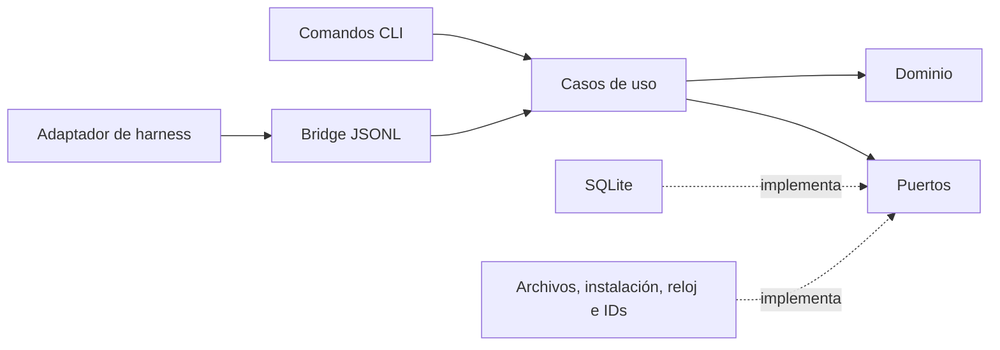

# Arquitectura del core de xper

Esta guía describe el dominio, los casos de uso, los puertos y las interfaces
Rust de xper. Cada adaptador documenta su organización interna dentro de su
propio paquete; la [guía del adaptador Pi](../adapters/pi/docs/architecture.md)
describe la integración actual.

La entrada al proceso es el CLI. El CLI expone dos interfaces: comandos de
terminal y un bridge JSONL que recibe peticiones de los adaptadores. Ambas
invocan casos de uso de `xper-application`.



Las flechas continuas muestran llamadas. Las implementaciones dependen de los
contratos del core. `composition.rs` crea y conecta las dependencias concretas.

## Mapa para leer el código

| Responsabilidad | Ubicación | Contenido |
| --- | --- | --- |
| Entrada al proceso | `crates/xper-cli/src/main.rs` | Argumentos y código de salida |
| Transporte del bridge | `crates/xper-cli/src/bridge/mod.rs` | Framing, handshake, sesiones y heartbeat |
| Traducción RPC | `crates/xper-cli/src/bridge/workflow.rs` | JSON → petición tipada → resultado → JSON |
| Presentación CLI | `crates/xper-cli/src/status.rs`, `setup.rs` | Texto/JSON y confirmación por terminal |
| Composición | `crates/xper-cli/src/composition.rs` | Apertura de SQLite y recursos de una sesión |
| Adaptadores locales | `crates/xper-cli/src/infrastructure/` | Reloj, IDs, artefactos e instalación local |
| Acciones del sistema | `crates/xper-application/src/use_cases/` | Coordinación de cada operación |
| Dependencias de las acciones | `crates/xper-application/src/ports.rs` | Lecturas, transacciones, evidencia e instalación |
| Vocabulario durable | `crates/xper-application/src/events.rs` | Eventos normalizados y conversión desde el dominio |
| Estado consultable | `crates/xper-application/src/read_models/` | Proyecciones y replay determinista |
| Política de evidencia | `crates/xper-application/src/policies/discovery.rs` | Relación entre visita, assignment, attempt y Brief |
| Reglas del kernel | `crates/xper-domain/src/` | Entidades, máquina de estados y transiciones puras |
| Persistencia | `crates/xper-store-sqlite/` | Transacciones, migraciones, leases y recuperación |

## Casos de uso como API de la aplicación

Cada operación tiene un módulo con una función `execute`. Los comandos de
workflow reciben un `Request` tipado y devuelven un `Outcome`; las consultas
reciben una selección explícita. No reciben JSON, argumentos de terminal ni
una conexión SQLite concreta.

| Entrada | Caso de uso | Resultado |
| --- | --- | --- |
| `run.start` | `start_run` | Iniciar Intake → Discovery o reanudar el run activo de la sesión |
| `assignment.start` | `start_discovery` | Crear assignment/attempt o reintentar un assignment pendiente |
| `attempt.finish` | `finish_attempt` | Registrar resultado, evidencia y cierre del assignment |
| `run.advance` | `advance_run` | Evaluar el gate de Discovery y entrar a Define |
| `run.status`, `xper status` | `get_run_status` | Leer proyección y timeline |
| `xper doctor` | `inspect_installation` | Diagnosticar la instalación sin modificarla |
| `xper init` | `initialize_workspace` | Coordinar preflight, consentimiento y preparación |

Las funciones explicitan las dependencias que necesitan. No hay un contenedor
global de servicios ni un bus de comandos. Añadir una acción consiste en
escribir su coordinación y conectarla a la interfaz que la exponga.

`initialize_workspace` recibe callbacks de presentación y consentimiento.
Decide cuándo invocarlos y cuándo permitir escrituras; el CLI decide cómo
mostrar los checks y cómo leer la respuesta. El adaptador informa qué fallos
puede reparar, por lo que la aplicación no necesita conocer IDs propios del harness.

## Puertos y garantías

- `RunReader`: consultar un run, sus eventos, el último run y el vínculo de una
  sesión. `get_run_status` sólo requiere este contrato.
- `RunRepository`: añade commits de límites completos. Crear el run y vincular
  su sesión forman una única operación atómica del puerto.
- `ArtifactReader`: comprobar disponibilidad de evidencia relativa al workspace.
- `Installation`: inspeccionar y preparar el scope seleccionado. Conserva
  archivos válidos y comprueba conflictos de backups antes de escribir.
- `Clock` e `IdGenerator`: contratos existentes del dominio, reutilizados por
  los casos de uso para que sus resultados se puedan reproducir en tests.

Una operación coordina una unidad coherente de persistencia: finalizar un
attempt exitoso registra el resultado, el artefacto y el assignment en el
mismo commit. La consulta devuelve únicamente estado persistido. La sesión
resuelve su run mediante el repositorio, sin mantener otra copia del vínculo
en el bridge.

Las leases, el fallback volátil, la apertura de la base y su cierre pertenecen
al adaptador y al lifecycle del proceso. El bridge añade la información de
durabilidad a su respuesta; los casos de uso no conocen SQLite.

## Qué pertenece a cada bloque

- Una regla sobre estados o transiciones de una entidad pertenece al dominio.
- La coordinación entre estado persistido, evidencia y efectos pertenece a un
  caso de uso. La política de Discovery consulta las relaciones de la proyección;
  la disponibilidad real de sus archivos se consulta a través de un puerto.
- Un evento durable describe un hecho con el vocabulario público de xper. La
  conversión desde eventos del dominio excluye objetivos y evidencia textual.
- Una proyección es un modelo de lectura reconstruible. No es la entidad `Run`
  del dominio ni un repositorio; su replay también valida la consistencia del log.
- Un puerto expresa una necesidad de la aplicación y las garantías que exige.
  Su implementación resuelve los detalles del sistema operativo o del proveedor.
- La interfaz valida la forma externa y traduce errores. La aplicación valida
  la operación para proteger también a futuros clientes que no usen el CLI.

Los errores de aplicación distinguen peticiones inválidas de fallos de una
dependencia y conservan la causa original. El bridge los convierte en los
códigos RPC existentes.

## Cómo ampliar la siguiente vertical

1. Expresar las reglas nuevas en el dominio y sus tests cuando correspondan.
2. Añadir la operación en `use_cases/`, con entrada y resultado explícitos.
3. Usar los puertos existentes o definir uno si aparece una necesidad nueva.
4. Probar la coordinación con dobles de los puertos y reloj/IDs deterministas.
5. Conectar el comando o método RPC y conservar sus pruebas de integración.

No se crean módulos para fases futuras ni una jerarquía de clases por cada
caso de uso. Los adaptadores locales permanecen como módulos del ejecutable
mientras sólo éste los componga; podrán extraerse a otro crate cuando otro
ejecutable los necesite.

El avance durable de Discovery sigue usando la proyección y los eventos de la
primera vertical. Esta refactorización no añade rehidratación de la entidad
`Run` desde el log ni generaliza las transiciones a fases aún no implementadas.
Al ampliar el workflow habrá que resolver esa integración con el kernel y
evitar mantener dos conjuntos independientes de reglas de transición.

## Verificación del core

Desde la raíz del repositorio:

```bash
npm run boundaries:core
cargo fmt --all -- --check
cargo clippy --workspace --all-targets --all-features -- -D warnings
cargo test --workspace --all-targets
```

Las reglas de [check-core-boundaries.mjs](../scripts/check-core-boundaries.mjs)
comprueban las dependencias entre crates y detectan I/O o transporte JSON/RPC
dentro de aplicación, construcción de eventos de workflow desde el CLI e imports
de implementaciones fuera de la composición o infraestructura. Sólo inspeccionan
el workspace Rust. Son comprobaciones estáticas de convenciones, no un análisis
completo del lenguaje.

Los tests de dominio y aplicación se ejecutan sin arrancar un harness; los de
aplicación usan dobles de sus puertos. Los tests de SQLite verifican sus garantías
transaccionales y de recuperación, y los del CLI comprueban sus interfaces.
La verificación conjunta del repositorio se describe en el
[README](../README.md#desarrollo).
