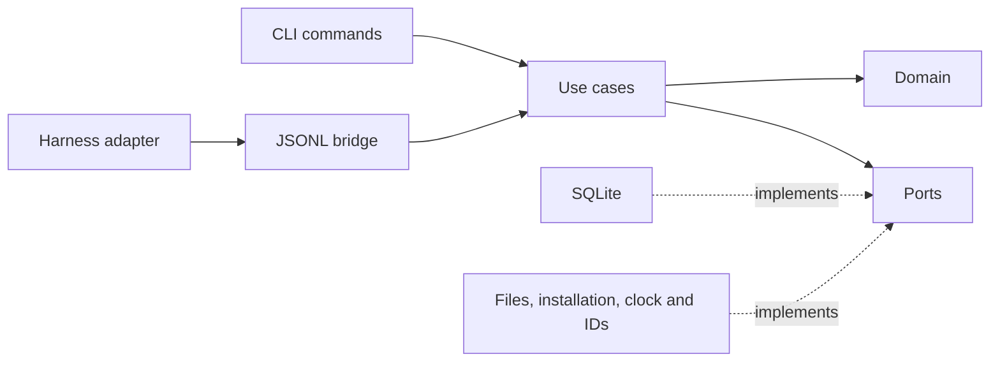

# xper core architecture

This guide describes xper's Rust domain, use cases, ports, and interfaces.
Each adapter documents its internal organization within its own package; the
[Pi adapter guide](../adapters/pi/docs/architecture.md) describes the current
integration.

The CLI is the process entry point. It exposes two interfaces: terminal
commands and a JSONL bridge that receives adapter requests. Both invoke
`xper-application` use cases.



Solid arrows show calls. Implementations depend on core contracts.
`composition.rs` creates and wires concrete dependencies.

## Code navigation map

| Responsibility | Location | Contents |
| --- | --- | --- |
| Process entry point | `crates/xper-cli/src/main.rs` | Arguments and exit code |
| Bridge transport | `crates/xper-cli/src/bridge/mod.rs` | Framing, handshake, sessions, and heartbeat |
| RPC translation | `crates/xper-cli/src/bridge/workflow.rs` | JSON → typed request → result → JSON |
| CLI presentation | `crates/xper-cli/src/status.rs`, `setup.rs` | Text/JSON and terminal confirmation |
| Composition | `crates/xper-cli/src/composition.rs` | Opening SQLite and session resources |
| Local adapters | `crates/xper-cli/src/infrastructure/` | Clock, IDs, artifacts, and local installation |
| System actions | `crates/xper-application/src/use_cases/` | Coordination of each operation |
| Action dependencies | `crates/xper-application/src/ports.rs` | Reads, transactions, evidence, and installation |
| Durable vocabulary | `crates/xper-application/src/events.rs` | Normalized events and conversion from the domain |
| Queryable state | `crates/xper-application/src/read_models/` | Projections and deterministic replay |
| Evidence policy | `crates/xper-application/src/policies/discovery.rs` | Relationships between visit, assignment, attempt, and Brief |
| Kernel rules | `crates/xper-domain/src/` | Entities, state machine, and pure transitions |
| Persistence | `crates/xper-store-sqlite/` | Transactions, migrations, leases, and recovery |

## Use cases as the application API

Each operation has a module with an `execute` function. Workflow commands
receive a typed `Request` and return an `Outcome`; queries receive an explicit
selection. They do not receive JSON, terminal arguments, or a concrete SQLite
connection.

| Entry point | Use case | Result |
| --- | --- | --- |
| `run.start` | `start_run` | Start Intake → Discovery or resume the session's active run |
| `assignment.start` | `start_discovery` | Create an assignment/attempt or retry a pending assignment |
| `attempt.finish` | `finish_attempt` | Record the result, evidence, and assignment completion |
| `run.advance` | `advance_run` | Evaluate the Discovery gate and enter Define |
| `run.status`, `xper status` | `get_run_status` | Read the projection and timeline |
| `xper doctor` | `inspect_installation` | Diagnose the installation without modifying it |
| `xper init` | `initialize_workspace` | Coordinate preflight, consent, and setup |

Functions make their required dependencies explicit. There is no global
service container or command bus. Adding an action means writing its
coordination and connecting it to the interface that exposes it.

`initialize_workspace` receives presentation and consent callbacks. It decides
when to invoke them and when to allow writes; the CLI decides how to display
checks and read the response. The adapter reports which failures it can repair,
so the application does not need to know harness-specific IDs.

## Ports and guarantees

- `RunReader`: query a run, its events, the latest run, and a session binding.
  `get_run_status` requires only this contract.
- `RunRepository`: adds commits of complete boundaries. Creating a run and
  binding its session are a single atomic port operation.
- `ArtifactReader`: check evidence availability relative to the workspace.
- `Installation`: inspect and prepare the selected scope. Preserve valid files
  and check backup conflicts before writing.
- `Clock` and `IdGenerator`: existing domain contracts reused by use cases to
  make their results reproducible in tests.

An operation coordinates one coherent unit of persistence: finishing a
successful attempt records its result, artifact, and assignment in the same
commit. Queries return only persisted state. The session resolves its run
through the repository without keeping another copy of the binding in the bridge.

Leases, volatile fallback, and opening and closing the database belong to the
adapter and process lifecycle. The bridge adds durability information to its
response; use cases do not know about SQLite.

## What belongs in each block

- A rule about an entity's states or transitions belongs in the domain.
- Coordination between persisted state, evidence, and effects belongs in a
  use case. The Discovery policy checks relationships in the projection;
  actual file availability is queried through a port.
- A durable event describes a fact using xper's public vocabulary. Conversion
  from domain events excludes objectives and textual evidence.
- A projection is a rebuildable read model. It is neither the domain `Run`
  entity nor a repository; its replay also validates log consistency.
- A port expresses an application need and the guarantees it requires. Its
  implementation handles operating-system or provider details.
- The interface validates the external shape and translates errors. The
  application validates the operation to protect future clients that bypass
  the CLI as well.

Application errors distinguish invalid requests from dependency failures and
preserve the original cause. The bridge converts them to the existing RPC codes.

## Extending the next vertical slice

1. Express new rules in the domain and its tests where appropriate.
2. Add the operation in `use_cases/`, with explicit inputs and results.
3. Use existing ports or define one when a new need appears.
4. Test coordination with port doubles and deterministic clocks/IDs.
5. Connect the command or RPC method and preserve its integration tests.

Do not create modules for future phases or a class hierarchy for each use case.
Local adapters remain executable modules while only that executable composes
them; they can move to another crate when another executable needs them.

The durable Discovery transition still uses the first vertical slice's
projection and events. This refactoring does not add rehydration of the `Run`
entity from the log or generalize transitions to unimplemented phases.
Extending the workflow will require resolving that integration with the kernel
and avoiding two independent sets of transition rules.

## Core verification

From the repository root:

```bash
npm run boundaries:core
cargo fmt --all -- --check
cargo clippy --workspace --all-targets --all-features -- -D warnings
cargo test --workspace --all-targets
```

The rules in [check-core-boundaries.mjs](../scripts/check-core-boundaries.mjs)
check crate dependencies and detect I/O or JSON/RPC transport in the application,
workflow event construction in the CLI, and implementation imports outside
composition or infrastructure. They inspect only the Rust workspace. These are
static convention checks, not a complete language analysis.

Domain and application tests run without starting a harness; application tests
use port doubles. SQLite tests verify transaction and recovery guarantees, and
CLI tests check its interfaces. Aggregate repository verification is described
in the [README](../README.md#development).
