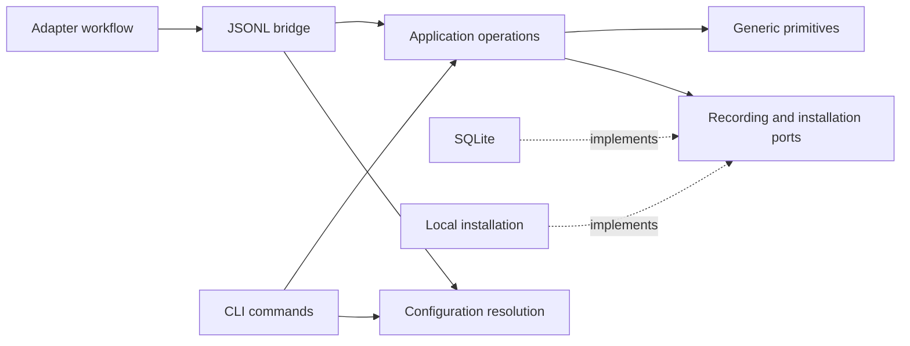

# xper core architecture

The Rust core resolves configuration and records execution facts reported by
adapters. It exposes terminal commands and a JSONL bridge. Workflow decisions
belong to the adapter: Rust has no knowledge-phase state machine, artifact
gates, execution-plan validator, or budget admission policy.

[RFC 0006](rfcs/0006-configuration-recording-and-adapter-workflows.md) explains
this boundary and the source-of-truth guarantees. The
[Pi guide](../adapters/pi/docs/architecture.md) describes the executable workflow.

Configuration preparation and recording delivery are background services to
Pi. Workflow start, execution, local status, and recovery do not await Rust.
The core may reject an invalid event or fail to respond without preventing Pi
from proceeding; its response determines delivery status only.



## Code navigation map

| Responsibility | Location | Contents |
| --- | --- | --- |
| Process entry point | `crates/xper-cli/src/main.rs` | Arguments and exit code |
| Bridge | `crates/xper-cli/src/bridge/` | Framing, handshake, sessions, RPC translation |
| CLI presentation | `crates/xper-cli/src/status.rs`, `setup.rs` | Text/JSON presentation |
| Composition | `crates/xper-cli/src/composition.rs` | Concrete configuration and recording resources |
| Local adapters | `crates/xper-cli/src/infrastructure/` | Installation and active-profile files |
| System operations | `crates/xper-application/src/use_cases/` | Append/query records and coordinate setup |
| Dependencies | `crates/xper-application/src/ports.rs` | Recording and installation guarantees |
| Event envelope | `crates/xper-application/src/events.rs` | Versioned reported event |
| Queryable state | `crates/xper-application/src/read_models/` | Generic projections and replay |
| Generic primitives | `crates/xper-domain/src/` | Identifiers and timestamps |
| Persistence | `crates/xper-store-sqlite/` | Atomic batches, deduplication, queries, and legacy inspection |
| Configuration | `crates/xper-config/` | Scope merge, profiles, context policy, model resolution |

## Public operations

| Entry point | Responsibility |
| --- | --- |
| `configuration.resolve` | Resolve routing against an optional model catalog; return adapter configuration |
| `profile.inspect`, `xper profile` | Inspect a profile or resolve its routes; activation is a CLI operation |
| `event.append` | Record a batch of adapter-reported events |
| `run.status`, `xper status` | Read the recorded projection and timeline; the bridge also reports recording durability |
| `xper doctor` | Diagnose installation and configuration without modifying them |
| `xper init` | Run preflight and prepare configuration while preserving existing files |

`run.start`, `assignment.start`, `attempt.finish`, and `run.advance` are no
longer core operations. Their decisions are local Pi workflow operations.
Transport version 1 alone does not imply support for those old methods; see
the [public contract](../schemas/README.md) for capability negotiation.

Functions receive explicit dependencies. There is no global service container
or command bus. The interface handles RPC envelopes, terminal arguments, and
error presentation; application operations work with typed inputs and ports.
An event's arbitrary JSON `data` is a reported value, not an RPC request for
the application to execute.

## Recording guarantees

`RecordedEvent` carries `schemaVersion`, `eventId`, `runId`, `occurredAt`,
`type`, and an object-valued `data`. `occurredAt` is an integer timestamp in
milliseconds. The adapter supplies identities and reports facts; Rust does
not create an attempt or infer a successful outcome on its behalf.

Envelope identities and type names have bounded byte lengths. Generic summary
labels and outcome categories are also bounded so inspection can fit the
transport. Values that cannot be summarized remain intact in the raw events;
their projection is unknown rather than silently truncated. An unbound legacy
run has a null session owner.

`RunRepository::append_events` records one run's batch atomically for an
attached session. The envelope version, identifiers, and session ownership are
validated. Repeating an event with the same ID and identical content is safe;
conflicting reuse of an ID rejects the batch. These are recording-integrity
rules, independent of any workflow's permitted transitions.

Generic projections interpret common run, phase, attempt, and model-usage
observations. They accept arbitrary phase names and event kinds. An adapter
can report a phase revisit without Rust deciding whether it was appropriate.
Unknown types remain in the timeline. `adapter.state` is opaque checkpoint
data: only its owning adapter can decide whether and how to resume it.

The query reports the latest observed status and phase alongside basic counts
and reported usage. Metrics carry `formulaVersion`; absent usage fields stay
unknown. Pi reports observed provider/model identities and usage from completed
assistant messages. Its cost carries `costSource: "pi_estimate"`; it is not a
verified provider bill or Pi's budget reservation. `inputTokens` excludes
cached tokens; `cacheReadTokens` and `cacheWriteTokens` remain separate event
metadata and are not part of the current aggregate. Rich rework,
acceptance, comparison, and critical-path metrics remain in
[XP-013](tasks/013-metrics-inspection.md).

Projections can be rebuilt from the event log. Reopening or replaying records
does not manufacture an attempt failure, enforce a gate, or launch recovery
work. A missing completion is incomplete evidence. Pi owns execution recovery
and reports any subsequent outcome.

## Persistence and compatibility

SQLite is the normal durable local store. Opening it, fallback storage, and
connection lifetime belong to infrastructure and composition. Responses
expose whether recording is persistent or volatile; an acknowledgement from
volatile storage does not promise survival after process exit.

Pi's outbox delivers independently of execution, so this store can lag the
live workflow. Rust rejection cannot undo an observed action or authorize its
retry. Pi retains and exposes rejected events separately from deliverable
pending records. The local adapter checkpoint is sufficient for workflow
recovery; a remote history query is not a prerequisite.

The original workflow tables remain available for inspection. Legacy events
are exposed with a `legacy.` type prefix and their original JSON data; the
run is marked legacy. No Rust workflow state machine is needed to read them.
These records lack the new Pi checkpoint and cannot be resumed as a new Pi
workflow merely by inspecting them.

Configuration retains scope merging, credential rejection, provider allowlists,
and model/thinking compatibility checks. The existing `workflow.knowledge`
configuration is passed to Pi as opaque adapter configuration for compatibility.
Pi validates and applies its budgets and human gates. Core configuration must
not decide the next role or reinterpret those workflow settings.
Pi prepares resolved configuration asynchronously and freezes the latest
available snapshot, or visible defaults, at run start. Late configuration
responses do not mutate that active run.

## Extending the core

1. Identify a configuration, recording, or inspection need.
2. Add an operation with explicit inputs and dependencies where needed.
3. Preserve atomicity, duplicate consistency, ownership, and historical data.
4. Test the operation independently of Pi and model credentials.
5. Update the protocol, fixtures, and consumers when the public contract changes.

Add workflow rules to the adapter that owns them. Add generic metric formulas
only when the reported inputs and completeness semantics are defined. A future
UI should query facts and projections rather than reconstruct execution policy.

## Core verification

From the repository root:

```bash
npm run boundaries:core
cargo fmt --all -- --check
cargo clippy --workspace --all-targets --all-features -- -D warnings
cargo test --workspace --all-targets
```

[check-core-boundaries.mjs](../scripts/check-core-boundaries.mjs) checks crate
dependencies and protects the configuration/recording boundary against
workflow-policy modules. Static checks complement responsibility review;
they cannot establish the semantics of every event field.

Application tests use explicit dependencies, while SQLite and bridge tests
verify recording transactions, idempotent retries, projection rebuilding,
legacy inspection, and interface errors with temporary resources. The
[README](../README.md#development) describes aggregate verification.
