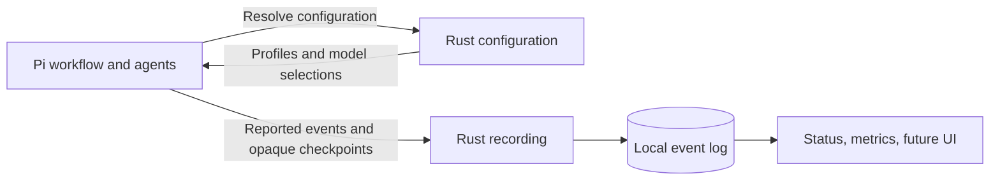

# RFC 0006: Configuration, recording, and adapter-owned workflows

- Status: accepted
- Date: 2026-09-28
- Supersedes: workflow ownership in RFCs 0001, 0004, and 0005
- Clarifies: configuration in RFC 0002 and passive observability in RFC 0003
- Implementation guides: [Rust core](../architecture.md), [Pi adapter](../../adapters/pi/docs/architecture.md)

## Decision

Xper's Rust service resolves configuration and records what adapters report.
The adapter owns the workflow. In Pi, that includes deciding which agent runs,
what evidence is required, when to advance or revisit a phase, and when to ask
the user. Rust does not need to know the workflow's sequence or rules.

The durable record is the source of truth about **reported execution facts**.
It supports inspection, metrics, and a future interface. It is not permission
to execute the next step, and it cannot prove an unreported action occurred.

| Rust core | Pi adapter |
| --- | --- |
| Merge configuration; resolve profiles and model selections | Choose the role to execute and apply the resolved selection |
| Provide initialization, diagnostics, and configuration inspection | Register commands, tools, hooks, and agent execution |
| Validate event identity, version, ownership, and duplicate consistency | Decide phases, gates, retries, approvals, and execution limits |
| Persist event batches and serve timelines and projections | Validate artifacts, feedback, and execution plans |
| Calculate metrics from reported facts | Report execution outcomes and workflow-specific meaning |
| Store adapter checkpoints without interpreting them | Define, validate, and restore its own checkpoint |

For example, a Design agent reports missing context. Pi decides to revisit
Discovery, prepares the next agent's inputs, and records the decision. Rust
stores the events and can show that the revisit occurred; it does not check
whether Design was allowed to return to Discovery.

## Meaning without workflow control

A small generic vocabulary describes runs, attempts, phases, outcomes, and
model usage. Phase names and additional event types are extensible data. The
recorder can count attempts and aggregate reported usage without knowing the
allowed phase sequence, role catalog, artifact schema, or gate policy.

Semantic metrics require explicit adapter facts. An accepted increment or a
rework relationship must be reported by the workflow that understands it.
Rust must not infer acceptance from a phase name, a tool completion, or a
structurally valid file. Formula versions and input completeness belong with
metrics; missing usage or cost is unknown, not zero. Budget reservations are
execution policy, not measured provider cost.

The current Pi capture records response provider/model identities and token
usage, keeping cache read/write counts separate from ordinary input/output.
Pi's cost calculation is explicitly labelled `pi_estimate`. Consumers must
preserve that provenance when presenting totals or comparing runs.

Configuration resolution has the same boundary: Rust answers which model a
configured role selects. Pi decides when that role runs. Record the effective
selection with the execution so later profile changes do not rewrite history.
Reported actual model changes must remain distinguishable from the requested
configuration. This decision does not add live profile switching or automatic
model fallback.

## Recording and recovery

Events have stable identities. An identical retry is idempotent; reusing an ID
for different content is an error. Acknowledgement and durability are separate:
volatile storage must never be presented as persistent history. Atomic batches
keep related observations together without making Rust their workflow arbiter.

Recording errors do not change an agent's outcome or authorize re-execution.
The adapter retains pending events and retries them with the same IDs. A local
checkpoint or pending-event file is recovery material; the acknowledged event
log is the shared inspection record. If storage is unavailable everywhere,
recovery cannot be guaranteed. Surface that limitation rather than inventing
complete telemetry. Missing end events remain incomplete until the adapter
reports an outcome; reopening SQLite must not manufacture a workflow failure.

An `adapter.state` event may carry a versioned checkpoint understood only by
its adapter. Rust preserves the JSON and can return it during inspection. It
does not enforce that checkpoint's state machine. Checkpoints should contain
identifiers and execution state, excluding prompts, artifact contents, and
credentials by default. Adapters are responsible for the content they report.

## Compatibility and consequences

The JSON-RPC transport remains version 1. The `configurationResolution` and
`eventRecording` capabilities identify the new API; the old workflow commands (`run.start`,
`assignment.start`, `attempt.finish`, and `run.advance`) are removed. Clients
must negotiate the new boundary rather than assume transport version implies
workflow API compatibility. The [public protocol](../../schemas/README.md)
defines the implemented shapes and errors.

Existing core-owned logs remain available for historical inspection. They do
not contain the Pi checkpoint needed to continue under the new ownership;
inspection compatibility does not imply workflow resumability. New runs use
the adapter's checkpoint and event stream.

Moving ownership preserves the existing Pi knowledge workflow and its gates.
It does not decide how much future freedom agents should have inside Pi.
Changes to that policy can now be made and tested within the adapter without
changing Rust's workflow vocabulary or replay rules.

Other adapters may implement different workflows and still use the same
configuration and recording service. Shared workflow code can be extracted
later when there are actual consumers; it is not a reason to restore workflow
control to Rust or create a speculative framework now.

Metrics are a central responsibility, but a full metrics CLI, comparison UI,
and dashboard remain separate work. [XP-013](../tasks/013-metrics-inspection.md)
tracks those deliverables. The current guides distinguish implemented queries
and aggregates from that intended direction.
